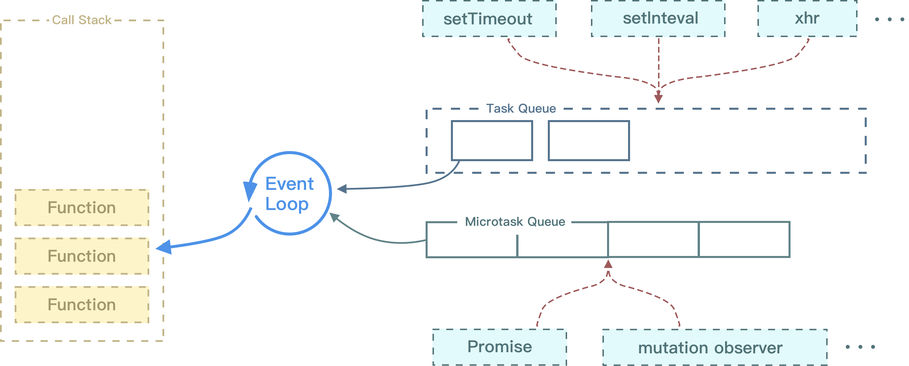

## 浏览器上的Event Loop

Event Loop是javascript的运行机制，也叫事件循环机制，决定了JS代码(任务)执行顺序，分为浏览器中的Event Loop和Node中的Event Loop。

由于javascript是单线程的，也就是说同一时刻，javascript主线程上只能执行一个任务,其他任务则需要排队等待。Event Loop机制就决定了这些任务的执行顺序。



如上图，JS在运行时先将所有同步任务放入执行栈（Call Stack)，同步任务由上往下顺序执行，且只有上一个任务执行完毕，才会执行下一个任务。同时程序中所有异步任务会根据任务类型放入不同的队列中。

**宏任务(Task)**：script ， setTimeout ，setInterval ，setImmediate ，I/O ，UI rendering

**微任务(Microtask)**：process.nextTick ，promise ，MutationObserver，其中 process.nextTick 为 Node 独有。

除了JS一开始就会执行的宏任务"script"，微任务都是优先于宏任务执行的，即先执行微任务队列中的任务，再执行宏任务队列中的任务。

看如下一段代码：

```javascript
console.log('script start')

async function async1() {
  await async2()
  console.log('async1 end')
}
async function async2() {
  console.log('async2 end')
}
async1()

setTimeout(function() {
  console.log('setTimeout')
}, 0)

new Promise(resolve => {
  console.log('Promise')
  resolve()
})
  .then(function() {
    console.log('promise1')
  })
  .then(function() {
    console.log('promise2')
  })

console.log('script end')
// script start => async2 end => Promise => script end => promise1 => promise2 => async1 end => setTimeout
```

使用Event Loop机制分析：

1. 首选执行同步代码,打印 console.log('script start')
2. 执行async1(), 它也是同步的，只是返回值是Promise，在内部首先执行 await async2()，由于await表达式是从右向左执行的，即先执行async2()，执行async2()里面的同步代码, 打印 console.log('async2 end')，然后执行await,碰到await会先执行函数外面的同步代码
3. 执行setTimeout函数放入宏任务队列
4. new Promise 内部属于同步代码，打印 console.log('Promise')
5. 将两个.then放入微任务队列
6. console.log('script end')属于同步任务，立即执行打印
7. 此时所有又回到async1()函数内部，await后的console.log('async1 end')，相对于.then(console.log('async1 end')),放入微任务队列
8. 所有同步任务执行完毕，先执行微任务队列，打印 "promise1"、“ promise2”、“async1 end‘，后执行宏任务队列，打印”script end“ 

**关于await**

await表示等待，是右侧「表达式」的结果，这个表达式的计算结果可以是 Promise 对象的值或者一个函数的值（换句话说，就是没有特殊限定）。并且只能在带有async的内部使用

使用await时，会从右往左执行，当遇到await时，会阻塞函数内部处于它后面的代码，去执行该函数外部的同步代码，当外部同步代码执行完毕，再回到该函数内部执行剩余的代码, 并且当await执行完毕之后，会先处理微任务队列的代码